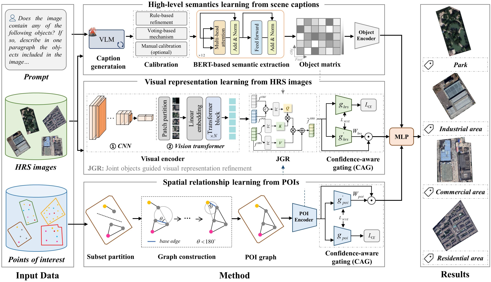

### Large vision-language model knowledge guided multi-source urban land-use mapping: A case study of representative cities across six continents

------------

This is an official implementation of VLM-LU framework.



#### Requirements

- pytorch >= 2.4.1
- python >= 3.8
- dgl >= 1.1.2

#### Instruction

##### 1. Data preparation

The Multi-CUN dataset and the relevant data required for the experiments are released at [Baidu Drive](https://pan.baidu.com/s/1XoN8VL9BDJ4gbQU0Pe_0Jw) [Code: kqe8]. You can download the dataset, unzip it, and place it in the ``data`` directory for experimental use.

##### 2. Caption generation

The research generates captions of parcels based on ``LLaVA v1.6 7B``, and the related codes can be obtained from the [official repository](https://github.com/haotian-liu/LLaVA) The ``eval/model_vqa.py`` in the official repository is employed to generate captions for parcels, with the designed prompt template as follows:

```
Does the image contain any of the following objects: 
“Bare land, Building, Cemetery, Cropland, Forest, Golf course, Harbor, Parking lot, Shadow, Sports field, Stadium, Storage tank, Traffic hub, Vegetation, Water area”. 
If so, describe in one paragraph the objects included in the image and their characteristics. Also describe in one sentence the information for each object that appears in the image. 
The format of the answer is as follows:
- The image contains {objects}
- {caption of this image}
- {object}: {object caption}
```

##### 3. Semantic representation learning from captions

The semantic representations of object captions can be extracted based on BERT. We have uploaded the processed semantic representations to [Baidu Drive.](https://pan.baidu.com/s/1XoN8VL9BDJ4gbQU0Pe_0Jw) You can download and use them directly. Alternatively, you can obtain the semantic representations using the following script:

```
python OBJExtraction.py --capPath <path to the generated captions> --dstPath <path to store the representations>
```

##### 4. Land-use classification

main.py is the program entry used to train the VLM-LU framework. You can configure your own multi-source land-use dataset or use the following script to conduct the experiment.

```
python main.py --labelPath <path to labels> --graphPath <path to graph> --graphIndexPath <path to graph index> --objPath <path to object features> --imgPath <path to image>
```


#### Citation

-------

If you use Multi-E2E in your research, please cite our paper.

